# Gloomhaven kampanjstatus

##  [Vadstena Kloster](allfathr.github.io/partysheet.png)
[Kardemummo](allfathr.github.io/players/cragheart.png)

[Voldermort1](allfathr.github.io/players/tinkerer.png)

[Skrallex](allfathr.github.io/players/mindthief.png)

[Blaze of Glory](allfathr.github.io/players/spellweaver.png)

[GORM](allfathr.github.io/players/brute.png)

## Länkar
[Karta](allfathr.github.io/map.png)  
[Regelbok](https://drive.google.com/open?id=10Sjmjdyc2Fan62Ubi1LsHXtTz2r5wU-o)

## Item shop

  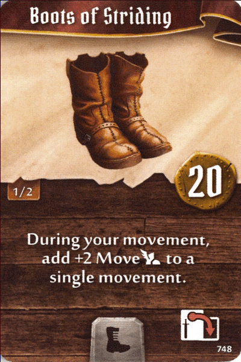
  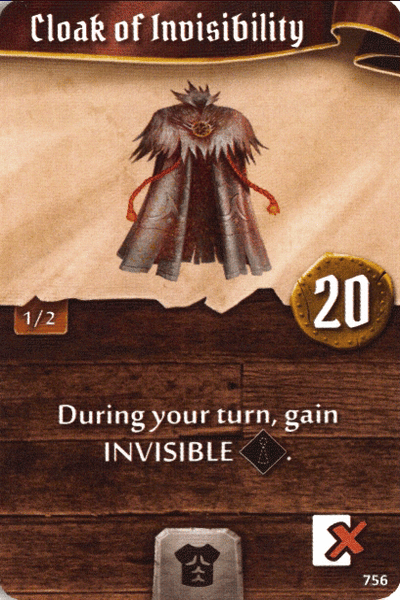
  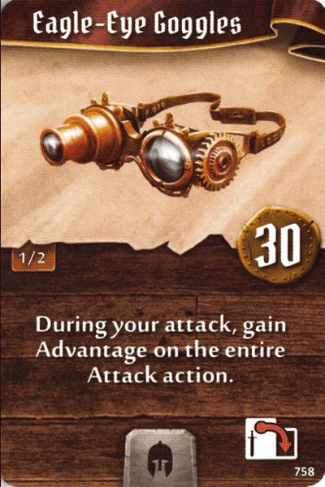
  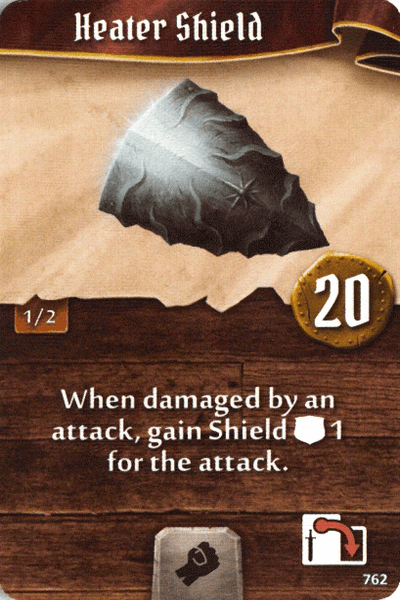
  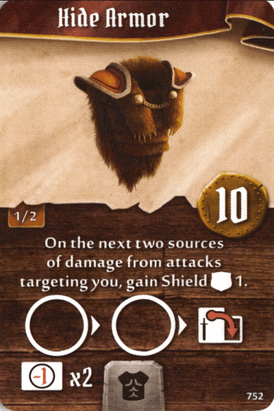
  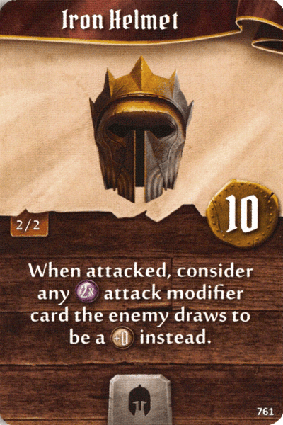
  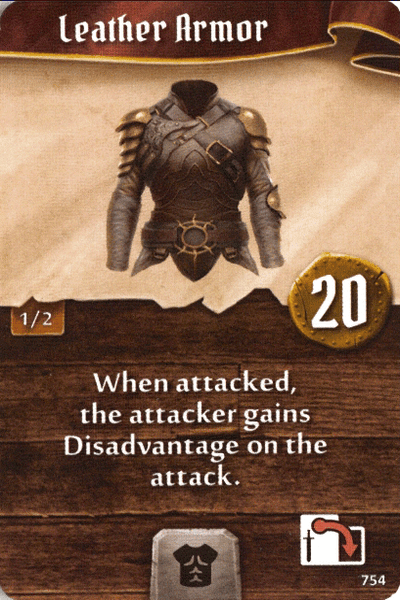
  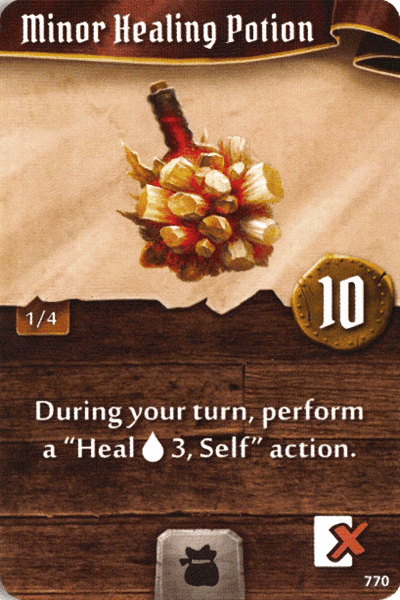
  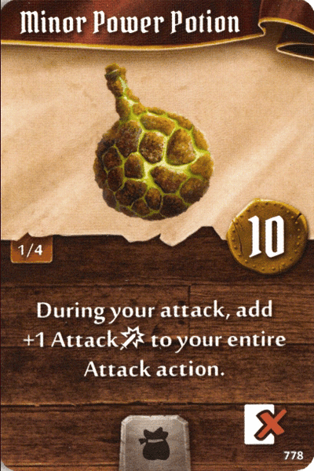
  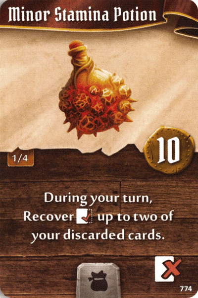
  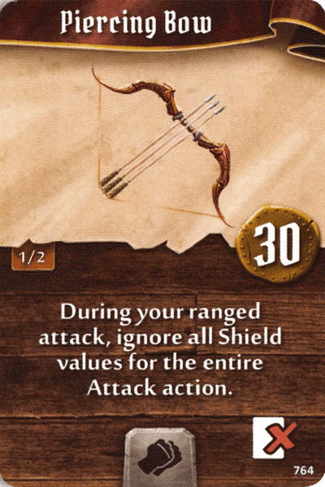
  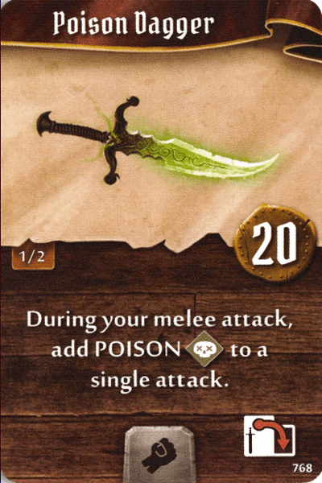
  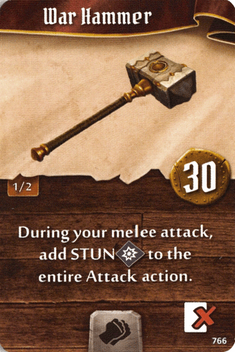
  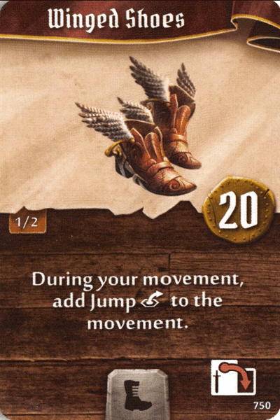
  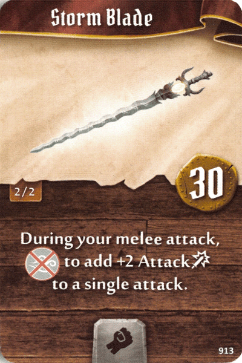
  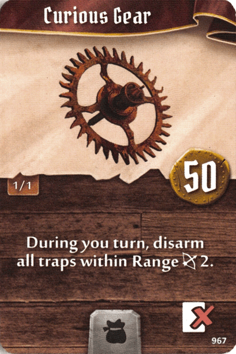
  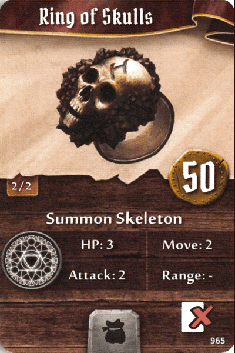

## Anteckningar till nästa gång
* Om den som retaliatar dör, aktiveras inte retaliaten.
* Ett monster som attackerar flera kommer placera sig i den mån att flera kan träffas.
* Vi har inte låst upp scenario 31 och 43.

## Thanks
BoardGameGeek user *paddirn* for *Interactive Map* and *Fillable party sheet PDF*  
BoardGameGeek user *Nickbarrett16* for *Fillable character PDFs*  
Github user *any2cards* for item images.

## Spoilers
This is no general solution and the site will be updated with our campaign progress. Therefore there might be spoilers and you're viewing at your own risk.
